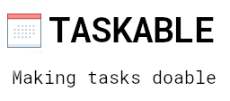

# Taskable

A desktop app to help you manage your tasks done during the day by helping you track the time you spent on a task

## Getting Started

Ensure you have downloaded a suitable [version](https://cmake.org/download/) of CMake and Visual Studio. CMake **3.8** is the minimum supported version. Visual Studio 2019 is used (not sure about previous versions).

### Windows

You will need [vcpkg](https://github.com/Microsoft/vcpkg) to compile and manage the dependencies.
Once you've installed and configured `vcpkg`, install the following libraries:

- sqlite3 (3.0 +)
- sqlite-modern-cpp (3.2 +)
- spdlog (1.4 +)
- wxwidgets (3.1 +)
- cpr (1.3 +)
- nlohmann-json (3.7 +)

Ensure that the Visual Studio _Ouput Window_ when the _CMake Server_ is runng that it does not give any warnings about missing packages.
You can now use Visual Studio to build the project by selecting the `x86-Release` configuration in the toolbar.

## Installing

### Windows Binaries

You can get a Windows Installer [here](https://github.com/ifexception/taskable/releases)

## Version

`v1.3.0`

## License

This project is licensed under the GPL-3 license - see the [LICENSE.md](LICENSE.md) file for details

## Acknowledgements
